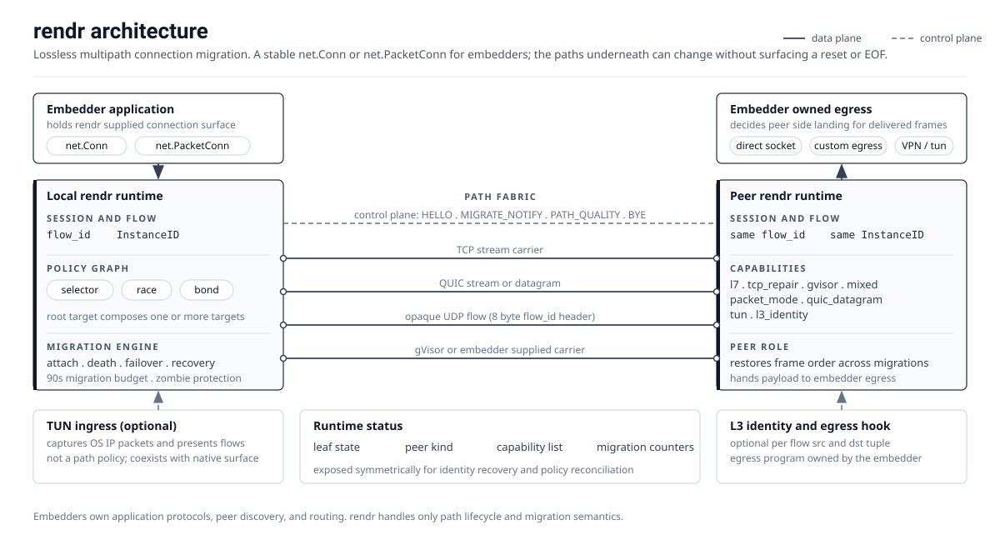

# rendr

rendr is a Go framework for lossless connection migration. An embedder
gets a stable `net.Conn` or `net.PacketConn`; rendr manages the
underlying network paths and can move traffic between them without
turning path loss into an application-visible reset or EOF.

The project is intentionally narrow: it is a migration layer, not a
proxy product. Proxy protocols, peer discovery, mesh topology,
configuration management, UI, and routing policy belong to the
embedding program.

## Model

Each application flow has a stable `flow_id`. Multiple underlying
paths can attach to that flow, and rendr decides which path or paths
carry frames at a given moment.

The core policy shapes are:

- `prime` / selector: use the best single path and migrate when
  quality justifies it.
- `race`: duplicate frames across paths and keep the first valid
  arrival.
- `bond`: distribute frames across paths to aggregate throughput.

These policies share the same migration engine and path-quality layer.
They can be used over stream or packet-shaped carriers depending on
the embedder's application protocol.

## Architecture Overview

## Definitions

| Term | Meaning |
|------|---------|
| Application flow | One logical application conversation carried by rendr. In stream mode this maps to one stable `net.Conn`; in packet mode it maps to one stable `net.PacketConn`. |
| `flow_id` | The stable per-flow identifier used by rendr peers to attach new paths to the same logical flow. |
| Path | One concrete underlying route between two rendr peers, such as a TCP connection, QUIC connection, UDP flow, gVisor carrier, or embedder-provided tunnel. |
| Transport | The adapter that creates a path from a `PathSpec`. Built-in examples include `tcp`, `quic`, `udpflow`, and `gvisor`. |
| Carrier | The byte-stream or datagram substrate used by a path. A carrier can be direct, proxied, tunneled, or custom. |
| Target | A node in the policy graph. A target can be a leaf `Path`, a `Selector`, a `Race`, or a `Bond`. |
| Root target | The policy graph entry point supplied to a `Dialer`. It replaces the older flat `Mode + Paths` shape for new integrations. |
| Selector / prime | The single-target quality policy. It chooses one child target at a time, favoring latency, jitter, loss, and stability. |
| Race | A redundancy policy that sends frames on multiple paths and accepts the first valid arrival. |
| Bond | An aggregation policy that distributes frames across paths to combine throughput. |
| Mixed carrier graph | A flow whose available paths may use different carrier families, for example TCP and UDP-backed paths. |
| Stream mode | rendr presents a `net.Conn`; byte order is preserved. |
| Packet mode | rendr presents a `net.PacketConn`; each write maps to one packet-shaped frame. |
| `InstanceID` | An ephemeral identifier for one running rendr runtime. It lets a client verify that additional paths attach to the same peer instance. |
| Capability | A string identifier exposed through status APIs, such as `rendr`, `l7`, `tun`, `l3_identity`, `tcp_repair`, `gvisor`, `mixed`, `packet_mode`, or `quic_datagram`. |
| Status | A runtime snapshot of local capabilities, peer kind, peer capabilities, and leaf path states. |
| Primary path / target | The preferred initial path or target used to establish the first handshake. Later traffic can still migrate according to policy. |
| TUN ingress | An L3 ingress layer that captures OS IP packets and turns flows into rendr sessions. It is not itself a path policy. |
| L3 identity | The original logical source/destination IP and port tuple carried with a flow for peer-side egress decisions. |
| Egress hook | Embedder-owned code that decides how peer-side traffic lands after rendr has migrated the flow. |
| TCP_REPAIR | A Linux kernel mechanism explored for native TCP state migration. |
| gVisor fallback | A user-space TCP path used when kernel TCP migration support is unavailable or not permitted. |

## Scope

rendr provides:

- Stable stream and packet connection surfaces for Go embedders.
- Path attach, path death classification, failover, recovery, and
  migration control.
- TCP, QUIC, opaque-UDP, and gVisor-backed carrier building blocks.
- Standard Go integration surfaces for custom transports and embedders.
- TUN/L3 identity building blocks for programs that need per-flow
  migration below an OS network stack.

rendr does not provide:

- Built-in proxy protocols such as Shadowsocks, Trojan, VLESS, or
  Hysteria.
- Peer discovery, mesh routing, NAT traversal, or topology control.
- Domain/CIDR policy routing or configuration management.
- A Web UI or operations panel.
- A default guarantee that the final destination server sees the
  original source IP.

xray-core is exercised as an external Go embedder in the compatibility
regression matrix; it is not a rendr dependency or public adapter package.
Code that previously imported `github.com/FrankoonG/rendr/xray` must own
that integration glue and supply standard stream or packet factories.

## Status

rendr is in active pre-`v1.0` development. The API is usable for
experimentation and internal integration, but policy graph and TUN
surfaces may still evolve as the migration model is hardened.

## License

See [LICENSE](./LICENSE).
